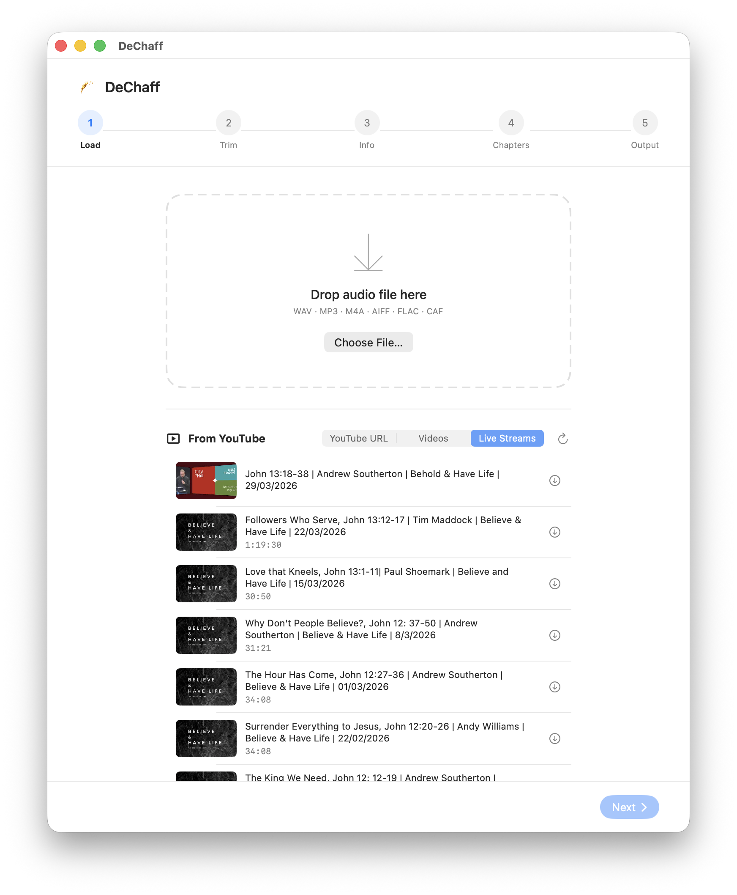
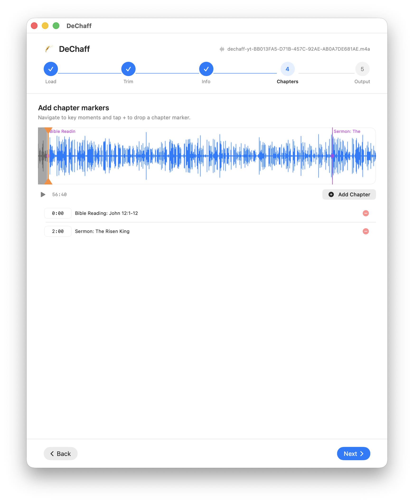
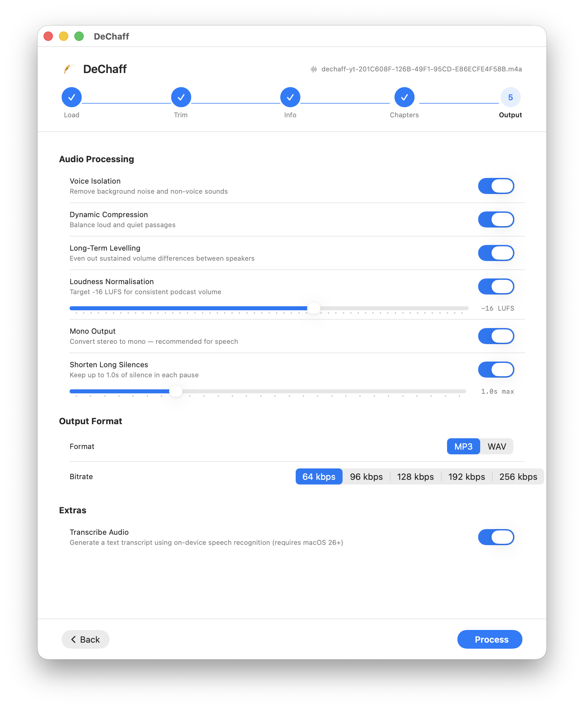

# DeChaff


A macOS app that prepares sermon recordings for podcast distribution. Work through a simple five-step wizard — load, trim, tag, chapter, configure — then hit Process. DeChaff cleans the audio, normalises loudness, encodes to MP3, and embeds ID3 tags with chapter markers automatically.

Built for the AV team at [City On a Hill](https://www.cityonahill.co.nz).

 







---

## Features

- **YouTube browser** — browse and download audio from a YouTube channel directly inside the app; yt-dlp is bundled and kept up to date automatically
- **AI metadata extraction** — automatically parses YouTube video titles into sermon title, Bible reading, preacher, and series fields using on-device Apple Intelligence (FoundationModels); runs concurrently with the audio download so fields are pre-filled by the time you reach the Info step
- **Voice isolation** — Apple's built-in `AUSoundIsolation` engine removes background noise, room reverb, and crowd sounds
- **Dynamic compression** — evens out volume differences between quiet and loud passages
- **Long-term levelling** — slow AGC that smooths volume differences across the recording with a ~3-second time constant, applied between voice isolation and loudness normalisation
- **Loudness normalisation** — targets a configurable LUFS level (default −16 LUFS, EBU R128) with a fast-attack/slow-release soft limiter to prevent clipping
- **Silence shortening** — trims long pauses to a configurable maximum duration
- **Mono mixdown** — reduces file size without quality loss for speech
- **MP3 encoding** — via bundled LAME, configurable bitrate (64–256 kbps)
- **ID3 tagging** — embeds title, artist, album, year, and cover artwork
- **Chapter markers** — CTOC/CHAP ID3 frames, compatible with podcast apps
- **On-device transcription** — generates a text transcript using macOS speech recognition (macOS 26+)
- **Waveform editor** — multi-resolution peak display with tiled rendering, native macOS scrollbars with inertia, cursor-anchored zoom, trim with drag handles or I/O keys, draggable chapter markers

## Quick start

1. **Load** — drop an audio file onto the drop zone, or pick a recent video from the YouTube browser (metadata fields are filled automatically via AI)
2. **Trim** — drag the orange handles or use the I / O keys to set start and end points
3. **Info** — fill in sermon title, preacher, bible reading, series, date, and artwork
4. **Chapters** — add chapter markers at key moments; first chapter defaults to the start, second to 2 minutes
5. **Output** — review processing options, then click **Process**

## Output filename

Named automatically from the tag fields:

```
YYYY-MM-DD Sermon Title, Bible Reading | Preacher | Series.mp3
```

Saved to the same folder as the original file, or to `~/Downloads` when the source was downloaded from YouTube.

## Requirements

- macOS 13.0 or later
- Xcode 15+ to build
- macOS 26+ for on-device transcription and AI metadata extraction

## Building

Clone the repo and open `DeChaff.xcodeproj` in Xcode. No external dependencies — LAME is bundled and re-signed at build time.

```bash
git clone git@github.com:howardgrigg/DeChaff.git
cd DeChaff
open DeChaff.xcodeproj
```

## How it works

Processing runs through up to seven passes:

1. **Voice isolation** — renders audio through `AUSoundIsolation` (Apple Audio Unit, subtype `'vois'`)
2. **Dynamic compression** — Apple `kAudioUnitSubType_DynamicsProcessor`, threshold −28 dB, 6 dB headroom (~4.7:1 ratio), +8 dB makeup gain, 3 ms attack / 150 ms release
3. **Long-term levelling** — 1-second windowed RMS gain envelope with Gaussian-like forward/backward EMA smoothing (±6 dB, ~3-second time constant)
4. **Loudness measurement** — integrated loudness via K-weighted biquad filter cascade (ITU-R BS.1770 / EBU R128)
5. **Gain normalisation** — single gain stage to hit target LUFS; fast-attack (1 ms) / slow-release (150 ms) soft limiter caps output at −1 dBFS to prevent clipping
6. **Silence shortening** — detects runs below −40 dBFS and rewrites audio trimming them to the configured maximum
7. **MP3 encoding** — LAME CBR at the selected bitrate

ID3 tags (including CTOC/CHAP chapter frames) are written directly as binary after encoding.

## License

MIT
